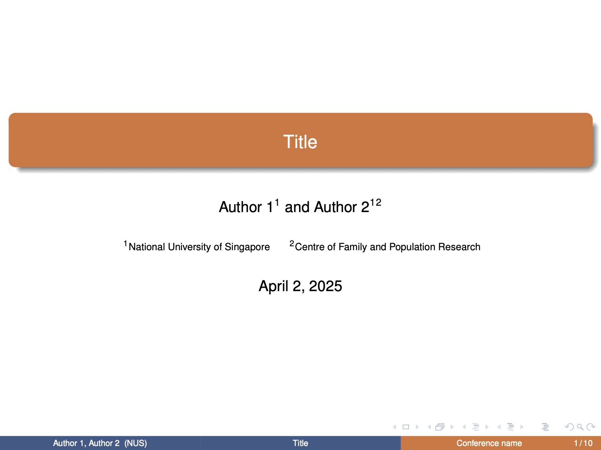

# NUS-Beamer-Slides

A $\LaTeX$ beamer template for academic presentations using the National University of Singapore's color scheme.

## Usage

Edit the [main.tex](./template/main.tex) file according to your content.

## Preview

Here are some sample slides from the template:

